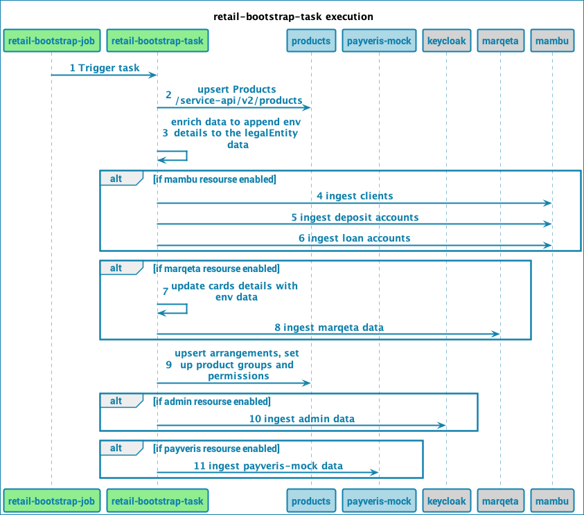
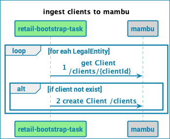
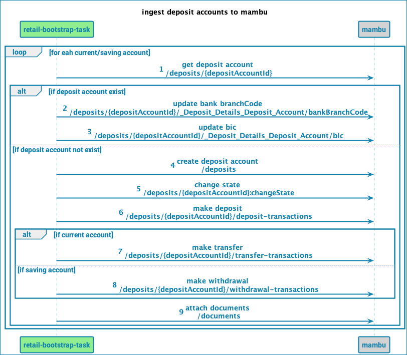
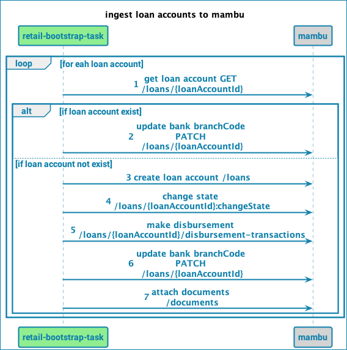
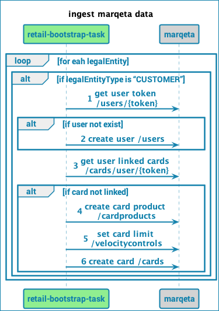
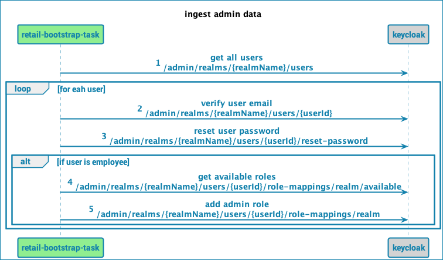
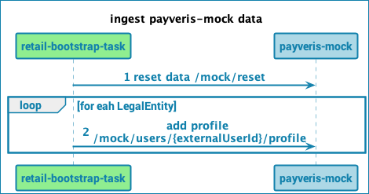

# Table of Contents

- [Repository Overview](#Repository-Overview)
  - [Resources Overview](#Resources-overview)
- [Sequence diagrams](#Sequence-diagrams)
- [Repository Description](#Repository-Description)
  - [Project Structure](#Project-Structure)
  - [Notable Files](#Notable-files)
  - [Legal Entity Hierarchy Overview](#Legal-Entity-Hierarchy-Structure-Overview)
  - [Project Dependencies](#Project-Dependencies)
- [Repository Configurations](#Repository-Configurations)
  - [DSC Configuration](#DSC-Configuration)
  - [Bootstrap Task Config](#Bootstrap-Task-config)
  - [Mambu config](#Mambu-config)
  - [Marqeta client config](#Marqeta-client-config)
  - [Configuration for users with debit or credit card](#Configuration-for-users-with-debit-or-credit-card)
  - [Admin(Keycloak) Client Config](#Admin(Keycloak)-client-config)
  - [Payveris Mock Client Config](#Payveris-Mock-client-config)
  - [Stream Config](#Stream-config)
  - [Runtime Config](#Runtime-config) 
- [Customisation in Project](#Customisation-in-project)
  - [Configuration Changes](#Configuration-changes)
  - [Component Changes](#Component-changes)
- [Getting Started](#Getting-Started)
  - [BaaS setup](#BaaS-setup)
  - [Local setup](#Local-setup)
  - [How to clean DB](#How-to-clean-DB)
  - [How to re-trigger on k8s](#How-to-re-trigger-on-k8s)
  - [How to run it with a local env](#How-to-run-it-with-a-local-env)

## Repository Overview

- This project implements cloud-native intuitive, Microservices design patterns, and coding best practices.
- 'retail-bootstrap-task' relies on Stream to perform data ingestion and validation - [Stream 2.0](https://github.com/Backbase/stream-services-2.0)
- It is **expected to be run as a job**: performing the expected tasks and exiting upon completion. Task execution is **idempotent**,
  as data is upserted
- It can be configured to create resources in Mambu (optional), Marqeta (optional), DBS and Identity (optional)
- Ingested data comes from files `src/main/resources/legal-entity-hierarchy.json`, `src/main/resources/product-catalog.json` and `remote-config-users.json`.
- The project follows [**CloudNative**](https://www.cncf.io/) recommendations and the [**twelve-factor app**](https://12factor.net/) methodology for building *software-as-a-service apps* to show how μServices should be developed and deployed.
- This project uses technologies broadly used in Backbase.Like Docker, Kubernetes, Java SE 11, Spring Boot, Spring Cloud
- Refer to [workflow guide](../../../docs/tree/master/backend) for the Backend CI Workflow documentation. Though this project only uses `develop-version-update.yml`, `master-initial-commit.yml` and `pull-request-check.yml` as it's not intended to be used as a production-ready artifact.

#### Resources overview
A successful run of this job will create the following DBS resources :
- Product Catalog (Product Types and Kinds)
- Root Legal Entity and its user(s)
- Reference Job Roles (Function Group Templates)
- Children Legal Entities and Users
- User Profiles (optional)
- Product Arrangements
- Function Groups, Data Groups and User Permissions
##### Identity (optional)
- Users
- Email verify
- Password setup
- Admin roles
- Remote Config roles
##### Mambu (optional)
- Users (Mambu Clients)
- Arrangements (funded)
- Random transactions
##### Marqeta (optional)
- Users
- Card Product
- Card Product Velocity
- Card

> Due to limitation in Marqeta public sandbox, which allows only one _active_ card per user, bootstrap task does not create more than one card for any user.
> The configuration (see Marqeta configuration below) allows specifying which users should have _debit_ or _credit_ card created.

#### Payveris Mock (optional)
- User creation

## Sequence diagrams
---







---
## Repository Description
### Project Structure
The project structure for each custom integration service follows the pattern as described below :

```
.
├── .github                       # All GitHub Actions files
│   ├── ISSUE_TEMPLATE            # Templates for 'major','minor','patch' releases
│   └── workflows                 # GitHub Actions workflows for CI
├── src                           # Source and Unit Test files
    ├── main                      # Application container projects
    │   ├── java/com/backbase/productled
    │   │   ├── api               # Controller classes
    │   │   │   └── ...
    │   │   ├── config            # Configuration classes
    │   │   │   └── ...
    │   │   ├── mapper            # Model classes
    │   │   │   └── ...
    │   │   └── service           # Service classes
    │   │       └── ...
    │   └── resources             # All resource files except core classes
    │       └── ...
    └── test                      # JUnit test file
        └── ...
```

To view individual classes for this repository, select relevant branch from the GitHub UI and then press ‘.'
This will open the GitHub Web Editor.Alternatively, you can also access the Web Editor by changing .com to .dev in the URL.

Expand each file in the Web Editor for explanation and purpose.

### Notable files

- `src/main/resources/product-catalog.json` - the definition of products catalog. It describes what would the bootstrap task do: what kind of banking products it is going to create and with what properties. The reference for that JSON can be obtained at [Product Catalog OpenAPI specification](https://github.com/Backbase/stream-services-2.0/blob/master/api/stream-product-catalog/openapi.yaml). Bootstrapping product catalog will be performed **before** bootstrapping legal entities hierarchy.
- `src/main/resources/legal-entity-hierarchy.json` - the definition of the whole hierarchy starting with root LegalEntity object. It describes what would the bootstrap task do: what kind of entities it is going to create and with what properties. The reference for that JSON can be obtained at [Legal Entity OpenAPI specification](https://github.com/Backbase/stream-services-2.0/blob/master/api/stream-legal-entity/openapi.yaml). Bootstrapping legal entities will be performed **after** bootstrapping product catalog.
- `src/main/resources/remote-config-users.json` - the definition of users in each role for accessing remote-config. It contains three parts, each related to one of the remote-config roles: `ROLE_REMOTE_CONFIG_ADMIN`, `ROLE_REMOTE_CONFIG_MANAGER`, `ROLE_REMOTE_CONFIG_DEVELOPER`. Assigning remote config roles will be performed **after** bootstrapping legal entities and during ingesting admin data.

### Legal Entity Hierarchy Structure Overview

----

In this section, we will give brief information about `legal-entity-hierarchy.json` that is available in the `resources` folder.

Since, `retail-bootstrap-task` is about to bootstrapping some initial data in the mostly newly created environment, the `legal-entity-hierarchy.json` file is the main file that you need to adjust when you have to do some changes with the users, roles, arrangements etc.

In the below image, you can see an overview of this file.


> Legal Entities of type “Bank” will have users associated with the Employee realm, all other legal entities will have users associated with the Retail realm.

### Reference Job Roles

---

#### Bank Job Roles
* Entitlements - Manager (Bank Admin)
* Assign Permissions - Manager (Bank Admin)
* Employee Portal
* Impersonation Entitlements - Manager (Bank Admin)
* Entitlements - Employee (Bank Employee)

#### Customer Job Roles
* Retail User - USA

### Bank Level Users


#### Product Catalog

* Checking Account
* Savings Account
* Credit Card
* Debit Card

### Example case John


### Reference Job Roles
| User     |      Job Role Name    |
|----------|:---------------------:|
| JOHN     |  Retail User - USA    |


### Project Dependencies
Explanation of the dependencies:
```
- Mambu clients
- Marqeta clients
- Identity clients
- Payveris Mock clients
```

---
## Repository Configurations
### DSC (basic-installation.yml) configuration
```yaml
installation: &currentInstallation ref
runtime: &currentRuntime dev


jobs:
  retail-bootstrap-task:
    imageRepository: <REPOSITORY_URL>/retail-bootstrap-task
    imageTag: 0.0.1
    resources:
      requests:
        cpu: "125m"
        memory: "256Mi"
      limits:
        cpu: "500m"
        memory: "2048Mi"
    env:
      mambu.bootstrapResourcesEnabled: "true"
      mambu.username:
        valueFrom:
          secretKeyRef:
            name: mambu-credentials
            key: username
      mambu.password:
        valueFrom:
          secretKeyRef:
            name: mambu-credentials
            key: password
      mambu.basePath:
        valueFrom:
          configMapKeyRef:
            name: mambu-env
            key: basePath
      mambu.branchKey:
        valueFrom:
          configMapKeyRef:
            name: mambu-env
            key: branchKey
      mambu.currentAccountProductKey:
        valueFrom:
          configMapKeyRef:
            name: mambu-env
            key: currentAccountProductKey
      mambu.savingsAccountProductKey:
        valueFrom:
          configMapKeyRef:
            name: mambu-env
            key: savingsAccountProductKey
      mambu.transactionsBeneficiaryAccountKey:
        valueFrom:
          configMapKeyRef:
            name: mambu-env
            key: transactionsBeneficiaryAccountKey
      marqeta.bootstrapResourcesEnabled: "true"
      marqeta.username:
        valueFrom:
          secretKeyRef:
            name: marqeta-credentials
            key: username
      marqeta.password:
        valueFrom:
          secretKeyRef:
            name: marqeta-credentials
            key: password
      marqeta.basePath:
        valueFrom:
          configMapKeyRef:
            name: marqeta-env
            key: basePath
      admin.bootstrapManualStepsEnabled: "true"
      admin.basePath: https://identity.{*currentRuntime}.{*currentInstallation}.live.backbaseservices.com/auth
      admin.username:
        valueFrom:
          secretKeyRef:
            name: identity
            key: identity-username
      admin.password:
        valueFrom:
          secretKeyRef:
            name: identity
            key: identity-password
      admin.defaultUserPassword: Pass1234
      payveris.bootstrapPayverisMockEnabled: "true"
      payveris.payverisBasePath: http://payveris-mock:8080
      environment.installation: *currentInstallation
      environment.runtime: *currentRuntime
```

#### Bootstrap Task config
As stated above, some components are optional and can be enabled or disabled with following config properties:

Property | Default | Description
--- | --- | ---
**mambu.bootstrapResourcesEnabled** | false | Enable resources creation in Mambu
**marqeta.bootstrapResourcesEnabled** | false | Enable resources creation in Marqeta
**admin.bootstrapManualStepsEnabled** | false | Enable manual steps in Identity console.
**payveris.bootstrapPayverisMockEnabled** | false | Enable user creation on payveris in-memory db.
**backbase.stream.legalentity.sink.useIdentityIntegration** | true | Enable user creation in Identity using integration service
**backbase.stream.legalentity.sink.userProfileEnabled** | false | Enable User Profile creation in DBS (requires `user-profile-manager`)

#### Mambu config
The following properties **must** be set as they have no default:

Property | Description
--- | ---
**mambu.basePath** | Base URL of Mambu API (i.e. `https://backbase.sandbox.mambu.com/api`)
**mambu.username** | API username
**mambu.password** | API password
**mambu.branchKey** | Branch ID where resources will be created
**mambu.currentAccountProductKey** | Product ID linked to Current Accounts
**mambu.savingsAccountProductKey** | Product ID linked to Savings Accounts
**mambu.creditCardAccountProductKey** | Product ID linked to Credit Cards
**mambu.transactionsBeneficiaryAccountKey** | Account used as beneficiary for the random transactions

#### Marqeta client config
The following properties **must** be set as they have no default:

Property | Description
--- | ---
**marqeta.basePath** | Base URL of Marqeta API (i.e. `https://sandbox-api.marqeta.com/v3`)
**marqeta.username** | API username
**marqeta.password** | API password
**marqeta.debugEnabled** | Enable to print request/response of every marqeta api call
**marqeta.debitCard.name** | Debit card name
**marqeta.debitCard.currencyCode** | Currency code for the card velocity
**marqeta.debitCard.usageLimit** | Represent how many times card can be used in a day
**marqeta.debitCard.amountLimit** | Represent how much amount can be used on a card
**marqeta.debitCard.metaData.atmMaxAmount** | ATM withdrawal max limit 
**marqeta.debitCard.metaData.atmMinAmount** | ATM withdrawal min limit
**marqeta.debitCard.metaData.onlineMaxAmount** | Online cad usage max limit
**marqeta.debitCard.metaData.onlineMinAmount** | Online cad usage min limit
**marqeta.debitCard.metaData.type** | Represent type of card either Debit or Credit
**marqeta.debitCard.metaData.subType** | Represent subtype of card either ATM or ONLINE
**marqeta.debitCard.metaData.brand** | Vendor of a card either visa or mastercard
**marqeta.debitCard.metaData.currency** | Currency code of a card
**marqeta.debitCard.metaData.replacementStatus** | Replacement status of card
**marqeta.creditCard....** | The same as above for credit card

##### Configuration for users with debit or credit card

> This configuration section is intended to ingest data for demonstration purposes only and were created by the bootstrap job during initial ingestion.
> It needs to be removed after implementing real client data ingestion and before running bootstrap task for the first time in real client environment.

Due to limitation in Marqeta public sandbox the bootstrap task creates only one card per each user.
The configuration provided in file `/src/main/resources/application.yml` allows specifying which users should have _debit_ or _credit_ card created:

Property | Description
--- | ---
**marqueta.cardUsers.debitCard** | The list of user's external ids which should have _debit_ card created
**marqueta.cardUsers.creditCard** | The list of user's external ids which should have _credit_ card created

Note that external user ids need to be prefixed with `$installation-$runtime-` string.
These two pieces will be replaced with actual installation and runtime names on the go.  

If a user is configured to have **both** debit and credit card, a warning is raised and **only debit card** is created.

By default, if a user is **not** configured to have either debit or credit card, bootstrap task will create a _debit_ card.
Hence this whole part of the config is optional - if skipped, every user will have just a _debit_ card.

#### Admin(Keycloak) client config
The following properties **must** be set as they have no default:

Property | Description
--- | ---
**admin.basePath** | Base URL of Identity console
**admin.username** | API username
**admin.password** | API password
**admin.defaultUserPassword** | Default password to be user for users.
**admin.remoteConfigUsersLocation** | Path to the remote config user/roles file.

#### Payveris Mock client config
The following properties **must** be set as they have no default:

Property | Description
--- | ---
**payveris.payverisBasePath** | Base URL of payveris-mock service.


#### Stream config:
Configuration properties used by Stream to interact with Backbase services (DBS, Token converter...).
Default values:
```yaml
spring:
  security:
    oauth2:
      client:
        registration:
          dbs:
            authorization-grant-type: client_credentials
            client-id: bb-client
            client-secret: bb-secret
            client-authentication-method: post
        provider:
          dbs:
            token-uri: http://token-converter:8080/oauth/token
backbase:
  stream:
    legalentity:
      sink:
        useIdentityIntegration: true
        userProfileEnabled: true
    dbs:
      user-manager-base-url: http://user-manager:8080
      access-control-base-url: http://access-control:8080
      arrangement-manager-base-url: http://arrangement-manager:8080
      transaction-manager-base-url: http://transaction-manager:8080
      limit-manager-base-url: http://limits-manager:8080
      user-profile-manager-base-url: http://user-profile-manager:8080

payveris:
  payverisBasePath: http://payveris-mock:8080
```

#### Runtime config

**environment.installation** | Installation Name
**environment.runtime** | Runtime name

These configs are currently derived from basic-installation.yml file using yml anchors which looks like below

```yaml
installation: &currentInstallation ref
runtime: &currentRuntime dev

jobs:
  retail-bootstrap-task:
    env:
      environment.installation: *currentInstallation
      environment.runtime: *currentRuntime
```


## Customisation in project

### Configuration changes

If integration done with Mambu and Marqeta then following properties(from k8 secrets, configmap) can be changed for their connection properties

- `mambu.username`
- `mambu.password`
- `mambu.baseUrl`
- `marqeta.basePath`
- `marqeta.username`
- `marqeta.password`

To point to a different Mambu branch, current/saving ProductKey and transactionsBeneficiary AccountKey change the following properties in k8 mambu-env configMap

- `branchKey`
- `currentAccountProductKey`
- `savingsAccountProductKey`
- `transactionsBeneficiaryAccountKey`

If not integrated with Mambu or Marqeta as core bank then the above config will not come into picture as the current implementation only support these two systems.

### Component changes
- `MambuService`: Replace this with your corresponding core banking functionality to create and retrieve data.
- `MarqetaService`: Replace this with your corresponding core banking's card system functionality to create and retrieve data.
- `MambuRestClientConfiguration` and `MambuConfigurationProperties`: core banking configuration
- `MarqetaRestClientConfiguration` and `MarqetaConfigurationProperties`: core banking's card system configuration
---
## Getting Started
### BaaS setup

- [ ] Step 1: Modify https://github.com/baas-devops-reference/ref-self-service/blob/main/self-service.tfvars by adding to `ecr` list name of new repository: `retail-bootstrap-task`
- [ ] Step 2: Checkout the following repository: https://github.com/baas-devops-reference/ref-applications-live/blob/main/runtimes/dev/basic-installation.yaml apply your deployment configurations example see _DSC (basic-installation.yml) configuration_ above.
- [ ] Step 3: Run the pre-commit to validate the configurations => ` pre-commit run --all-files --show-diff-on-failure --color=always`
- [ ] Step 4: Commit and Push your changes; wait for the template rendering and lint jobs to complete
- [ ] Step 5: Merge into `main` to trigger deployment.

### Local setup
- [ ] Step 1: Ensure to check the prerequisites for [local developer environment](https://community.backbase.com/documentation/ServiceSDK/latest/create_developer_environment)
- [ ] Step 2: Create `src/main/resources/application-local.yaml` file, then add and modify:
```yaml
  mambu:
    baseUrl: https://projectmoustache.sandbox.mambu.com/api
    username: <YOUR_MAMBU_USERNAME>
    password: <YOUR_MAMBU_PASSWORD>
    branchId: product-led
  marqeta:
    basePath: https://sandbox-api.marqeta.com/v3
    username: <YOUR_MAQETA_USERNAME>
    password: <YOUR_MAQETA_PASSWORD>
  admin:
    basePath: https://identity.dev.ref.live.backbaseservices.com/auth
    username: <IDENTITY_ADMIN_USERNAME>
    password: <IDENTITY_ADMIN_PASSWORD>
    defaultUserPassword: <DEFAULT_USER_PASSWORD> # Pass1234
  payveris:
    payverisBasePath: http://localhost:{port-forwarded} # Check application-local-with-remote-k8s.yml file
```
- [ ] Step 3: Make sure all the services needed by the bootstrap task are available. You can:
  - run them locally,
  - use [Telepresence](https://www.telepresence.io/),
  - manually provide port forwards to your Kubernetes cluster. The list of services needed can be found in `src/main/resources/application-local-with-remote-k8s.yml`. You can use the same file as Spring Boot configuration (`-Dspring.profiles.active=local,local-with-remote-k8s`) in the next step. The port forwards can be created using the following K8s command:

    ```kubectl -n backbase port-forward $(kubectl -n backbase get pods| grep 'token-converter' -m1 | cut -d' ' -f1) 18080:8080 ```

    where you obviously need to replace the `token-converter` with any service you want to port forward to, and `18080` with your desired local TCP port (they have to be unique on your machine).
  Also, there is an available script called `port-forward.sh`, so basically, you can run it and it will create corresponding port-forwarded services from your local to desired k8s cluster.
- [ ] Step 4: Run command => `mvn spring-boot:run -Dspring.profiles.active=local`
- [ ] Step 5: To run the service from the built binaries, use => `java -jar target/retail-bootstrap-task-x.y.z-SNAPSHOT.jar -Dspring.profiles.active=local`

In case you had 503 errors in your logs when running the job locally for remote k8s, it means that it cannot reach the services.
Port-forwarded ones shouldn't be problem but if you put such direct urls(for example, `url of identity for AdminService`) then you should adjust your run command with proxy.
This works with Intellij normally.
````shell
-DproxySet=true -DproxyHost=webproxy.infra.backbase.cloud -DproxyPort=8888
````
### How to clean DB
It is likely that there are execution errors when running the bootstrap task and it is possible due to some inconsistencies in Database. This can cause bootstrap task to fail even after repeated executions.
In such cases, it is wise to clean the Database for a fresh run of the job. The `retail-bootstrap-cleanup.sh` script is available in the `scripts` folder in the project.

Before the scripts, we have some pre-requisites.
* You are already connected to k8 cluster from your terminal
* You have already installed `jq`

#### retail-bootstrap-cleanup.sh

------
Helper script for `retail-bootstrap-task` which can be used to clean the data ingested by Retail bootstrap task in previous run and perform following actions

* Deletes the users from `employee` and `retail` realm of `Identity`
* Re-create database schema of dependent DBS services i.e. `AccessControl`, `UserManager`, `UserProfile` , `ArrangementManager` and `TransactionManager`
* Restart k8s pods to create default data from product using `Liquibase`

Once everything is good with the result of the script then you can re-trigger the job(Check [Re-trigger the job](#How-to-trigger-on-k8s)).

### How to trigger on k8s
Run the below command and job to delete the Kubernetes job, it will be re-triggered after a few minutes.
````shell
kubectl delete job <retail-bootstrap-task-job-name>
````

### How to run it with a local env
This section can be updated/modified/moved later on. 
Now, there will be a brief of information that you can run the task in a fresh local env.

Firstly, download the template from `start.backbase.com` (You can pick the `Employee App` template)
After unzip the file, go to `dbs/access-control/user-manager` folder and add below configuration to the `application.yml`

````yaml
backbase:
  users:
    identity-endpoints-enabled: true
    identity-integration-enabled: true
````

Then, go to `identity/identity-integration-service` folder and add below configuration to the `application.yml`

````yaml
identity:
  .....
  realmConfiguration:
    realms:
      employee:
        enableUser: true
        useTemporaryPassword: false
      retail:
        enableUser: true
        useTemporaryPassword: false
````

And then, clone the `modelbank-bb-identity` project from here -> https://github.com/baas-devops-reference/modelbank-bb-identity

Note : In case of using OOTB Identity, then the realm files should be imported -> https://github.com/baas-devops-reference/modelbank-bb-identity/tree/master/realms

These were the configuration related changes. Now, we can try to start one by one all needed services.

Go to the `platform` folder and run below commands.
````shell
docker-compose up -d
mvn blade:run
````

Then, visit these folders(`access-control`, `product-summary`, `transactions` and `identity`) and run the below commands.
````shell
mvn clean install -Pclean-database
mvn blade:run
````

And lastly, go to the `modelbank-bb-identity` folder and run the below command.
````shell
docker-compose up -d
````
Then, you can check them in the registry -> `http://localhost:8080/registry/`

After that, you need to update corresponding service path in the application.yml of the bootstrap task.

For example;
````yaml
user-manager-base-url: http://localhost:8086/user-manager # this url can be find from the registry so you need to update the urls regarding that concept.
````
Also, in the bootstrap task, most of the steps are optional, so you may set false that steps which you don't need to run(For example, mambu and marqeta)

---
## Contributions
Please create a branch and a PR with your contributions. Commit messages should follow [semantic commit messages](https://seesparkbox.com/foundry/semantic_commit_messages)
